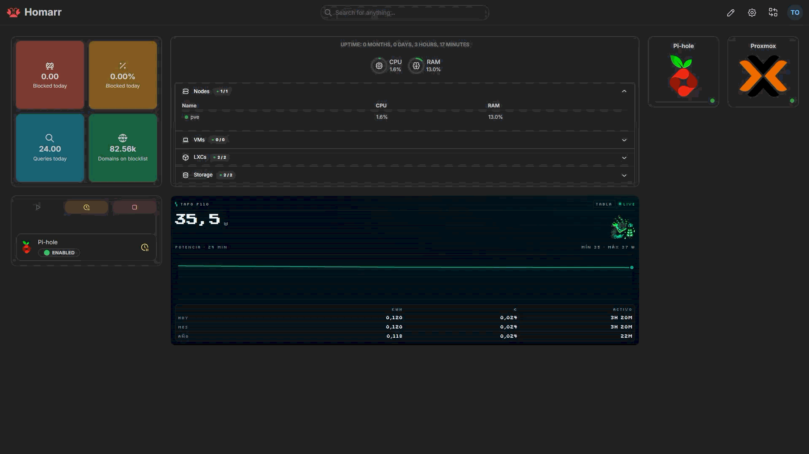

# Monitor de consum del Homelab

Aquest petit servei serveix per veure quant està consumint el meu homelab en temps real.

La idea va sortir perquè volia saber si tenir el servidor encès 24/7 em sortiria gaire car, i al final ha acabat sent un mini projecte bastant més complet del que semblava al principi 😅.

Ara mateix faig servir un **TP-Link Tapo P110**, que em dona les dades de consum del servidor.

## Demo




## Com funciona

El flux actual és més o menys aquest:

```text
Tapo P110
   │
   │ Xarxa local
   ▼
Sampler Python
   │
   ├── lectura cada 10 segons
   ├── última mostra en memòria
   └── una mostra/minut a SQLite
            │
            ▼
         FastAPI
        ├── /power
        ├── /health
        └── /widget
             │
             ▼
           Homarr
```

El sampler és l'únic procés que parla directament amb el P110.

Això evita que cada pestanya de Homarr faci consultes independents al dispositiu. El servei consulta el Tapo a un ritme fix i la API simplement serveix l'últim valor disponible.

Si la mostra és massa antiga, `/power` retorna `503` i el widget passa a mostrar-se com a **OFFLINE**.

## Què mostra

Ara mateix el widget ensenya:

- Potència actual en W
- Consum d'avui en kWh
- Cost d'avui en €
- Consum del mes
- Cost del mes
- Runtime d'avui
- Consum anual
- Cost anual
- Runtime anual mesurat pel servei
- Estat LIVE / OFFLINE

El cost es calcula a partir del preu configurat per kWh.

## Històric

Les mostres es guarden en una base de dades SQLite.

```text
samples
├── ts
└── power_w
```

Es guarda aproximadament **una mostra per minut**.

SQLite funciona en mode WAL per poder llegir l'històric mentre el sampler continua guardant dades.

El volum de Docker manté la base de dades encara que es recreï el contenidor.

## Variables d'entorn

Les credencials i configuració van al `.env` de l'arrel del repo.

Exemple:

```env
TAPO_USERNAME=
TAPO_PASSWORD=
TAPO_IP=192.168.68.200
ELECTRICITY_PRICE_EUR_KWH=0.20

POWER_DB_PATH=/data/power.db
POLL_SECONDS=10
STORE_SECONDS=60
ON_THRESHOLD_W=1
RETENTION_DAYS=400
```

El `.env` real **no es puja al repositori**.

## Docker

Per construir i aixecar el servei:

```bash
docker compose up -d --build
```

Per veure l'estat:

```bash
docker compose ps
```

Per veure logs:

```bash
docker compose logs -f power-monitor
```

## API

### Consum actual

```text
GET /power
```

Exemple:

```json
{
  "power_w": 35.456,
  "today_kwh": 0.098,
  "year_kwh": 0.098,
  "today_runtime_min": 163,
  "year_runtime_min": 7,
  "measuring_since": "2026-08-27T18:42:24"
}
```

### Health check

```text
GET /health
```

### Widget

```text
GET /widget
```

Aquest endpoint serveix el widget HTML/CSS/JS que després s'incrusta directament a Homarr.
