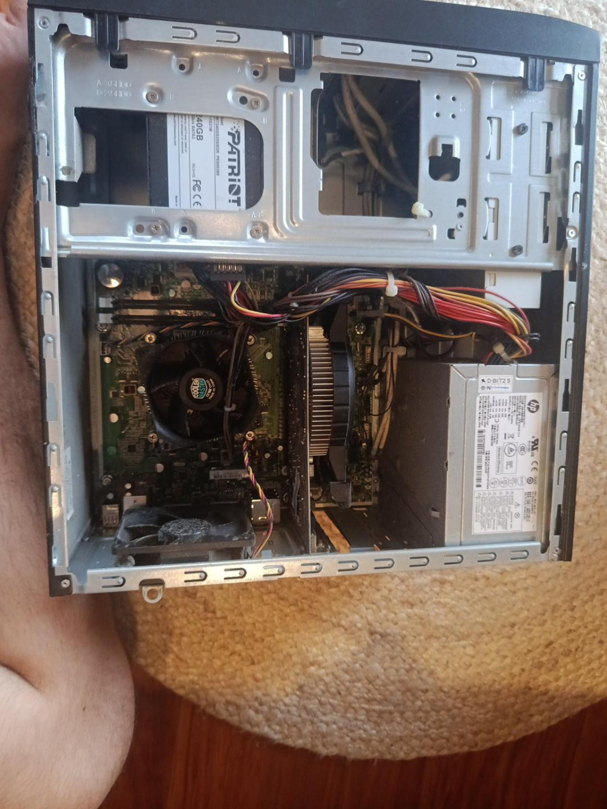
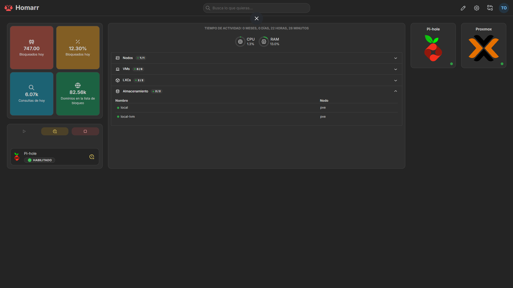

# Homelab

Aquest repo és per anar documentant el meu petit homelab de casa.

La idea no és muntar res superprofessional des del primer dia. Vull aprofitar un PC vell que tenia per casa per aprendre coses de Linux, xarxes, virtualització, Docker, serveis, automatització i una mica de DevOps en general.

Ara mateix el servidor és un **HP Pavilion p6-2301es** bastant antic, però per començar ja em serveix de sobres.



## Hardware actual

- HP Pavilion p6-2301es
- Intel Core i3-3220 @ 3.30 GHz
- 16 GB DDR3-1600 (2x8 GB)
- SSD Patriot Blast de 240 GB
- Proxmox VE com a sistema base

La RAM no hi era quan vaig recuperar el PC, així que el primer problema del homelab van ser **5 pitidos al fer boot**. Al final era simplement que no tenia RAM instal·lada 😭.


## Què hi ha muntat ara mateix

| Servei | Què fa | On està |
|---|---|---|
| **Proxmox VE** | Hypervisor, la base de tot | `192.168.68.251:8006` |
| **Homarr** | El dashboard des d'on entro a tot | LXC + Docker a `192.168.68.252:7575` — [docs](homarr/README.md) |
| **Pi-hole** | DNS de casa i bloqueig d'anuncis i trackers | LXC a `192.168.68.253` — [docs](pi-hole/README.md) |
| **Power Monitor** | Consum del homelab en temps real amb un Tapo P110 | Docker, port `8765` — [docs](P110/README.md) |
| **LoL Tracker** | Les meves partides de League en un widget del dashboard | Docker, port `8766` — [docs](lol-tracker/README.md) |

Totes les IPs del homelab van de la `.251` cap amunt perquè el DHCP del router arriba fins a la `.250`. El mapa sencer de la xarxa és a [docs/network.md](docs/network.md).

El monitor de consum i el tracker de League són els únics que he programat jo. La resta són serveis que he anat muntant per aprendre.

El homelab gasta uns **35,5 W en repòs**, que amb el meu preu de la llum són uns 63 €/any. A [docs/consum.md](docs/consum.md) hi ha el desglossament, què he provat per baixar-ho i què queda per fer.



## Com està organitzat el repo

```text
docs/        documentació general (hardware, xarxa, consum, problemes)
pi-hole/     notes del Pi-hole
homarr/      compose i notes del dashboard
P110/        el monitor de consum (codi propi)
lol-tracker/ el tracker de League (codi propi)
docker/      compose dels serveis que vagi muntant
ansible/     playbooks (encara buit)
proxmox/     configuració i notes de Proxmox
scripts/     scripts petits de manteniment
```

Les carpetes buides ja estan pensades per anar-les omplint a mesura que automatitzi coses.

## Què ve després

A [TODO.md](TODO.md) hi tinc la llista de coses que vull anar fent i els serveis que vull afegir.

El següent de la llista són les **còpies de seguretat**, que ara mateix no en tinc cap i tot viu en un sol disc 😅. Després toca DNS local + reverse proxy per deixar d'anar recordant IPs i ports.

## Objectiu

La gràcia és que el servidor físic pugui canviar amb el temps, però les configuracions i el que vaig aprenent quedin aquí guardats.

Ara és un i3 vell amb 16 GB de RAM. Si algun dia tinc més pressupost, la idea és ampliar hardware i continuar fent créixer el homelab sense començar de zero.
