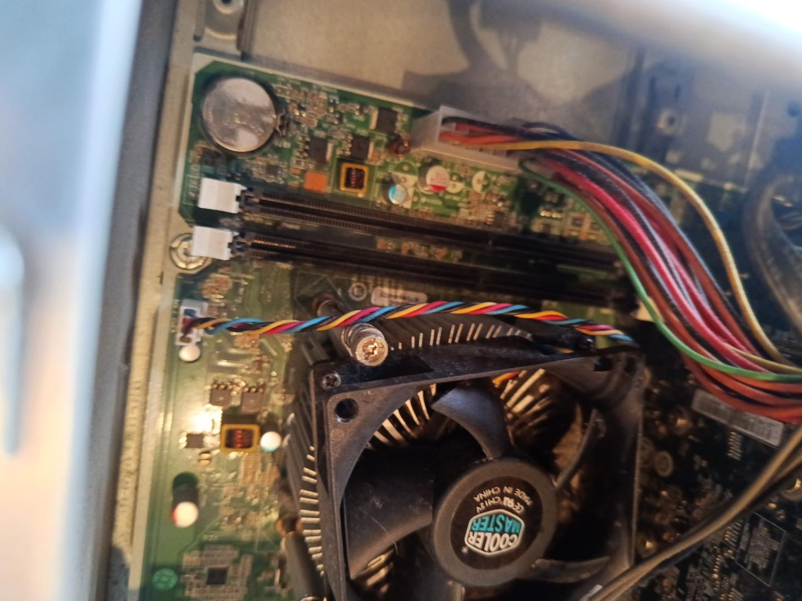
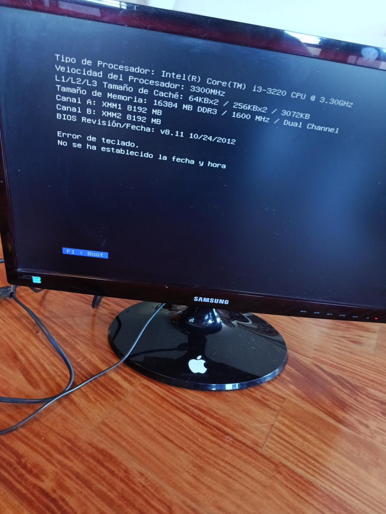
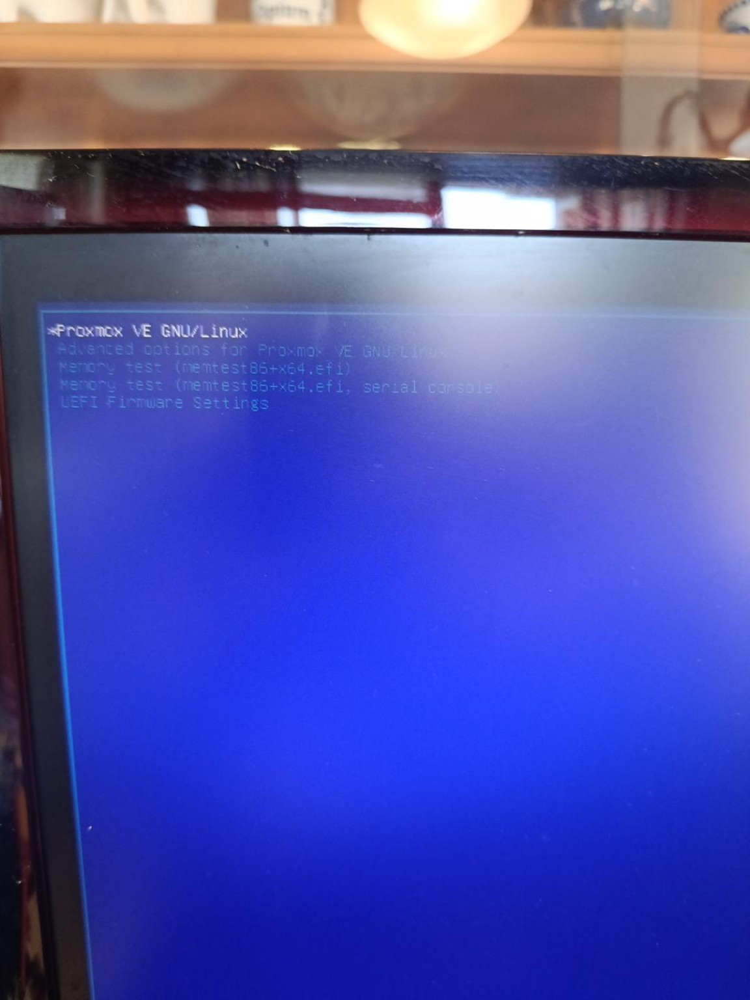

# Troubleshooting

Aquí vaig apuntant els problemes que em van sortint i com els he solucionat. Segurament serà el fitxer que més creixerà 😂.

## 1. El PC feia 5 pitidos i no arrencava

### Problema

En encendre el HP:

- feia 5 pitidos seguits
- el LED es posava taronja
- parava aproximadament 1 segon
- tornava a repetir

### Causa

El PC no tenia cap RAM.

Els slots estaven buits:



### Solució

Vaig instal·lar:

```text
2x8 GB DDR3-1600
```

Després d'instal·lar bé el primer mòdul, els pitidos van desaparèixer. Amb els dos instal·lats, la BIOS va detectar els 16 GB correctament.



---

## 2. Proxmox avisava que KVM no tenia virtualització

### Problema

Durant la instal·lació apareixia un missatge dient que no es detectava suport de virtualització per KVM.

### Causa

Intel VT-x estava desactivat a la BIOS.

### Solució

Entrar a la BIOS del HP i activar **Virtualization Technology / VT-x**.

Després d'això vaig poder continuar amb la instal·lació normalment.

---

## 3. Proxmox estava en una IP que no era de la meva xarxa

### Problema

Proxmox estava configurat com:

```text
192.168.100.2
```

però el meu PC tenia:

```text
192.168.68.200
```

amb gateway:

```text
192.168.68.1
```

Per tant, estaven en subxarxes diferents.

### Solució

Canviar Proxmox a:

```text
192.168.68.250/24
```

Gateway:

```text
192.168.68.1
```

I actualitzar també `/etc/hosts` perquè `pve.home.arpa` apuntés a la nova IP.

---

## 4. Ping funcionava però la web de Proxmox no carregava

### Proves

Des de Windows:

```powershell
ping 192.168.68.250
```

responia correctament.

Al servidor vaig comprovar:

```bash
systemctl status pveproxy
ss -lntp | grep 8006
curl -k https://127.0.0.1:8006
curl -k https://192.168.68.250:8006
```

`pveproxy` estava actiu i el port `8006` estava escoltant correctament.

Finalment vaig poder entrar a:

```text
https://192.168.68.250:8006
```



---

## 5. Data/hora de BIOS

El PC també ha mostrat algun avís dient que no tenia la data i hora configurades.

Probablement la pila CMOS **CR2032** està gastada, cosa bastant normal en un PC tan vell.


## 6. Canvi router principal

Com soc bastant bobo no al canviar de l'adaptador al router ZTE no em vaig catar que no estaven dins de la mateixa red ja que el router tenia 192.168.0.1 i no 192.168.68.1, no em vaig catar i vaig estar 1 fent arp request i tota la vaina pq funques. Amb inspiració divina vaig girar el router i vaig veure que era 0 i no 68.
Però dsp de fer la pesca i canviar totes les ips, vaig veure que podia conectar el cable d ethernet al deco del costat, que torna a estar a la 68, per comoditat ho vaig fer. Actualment estic dins de la 68!


Pendent:

- [ ] canviar la pila CR2032
- [ ] comprovar que pot arrencar sense teclat ni pantalla
