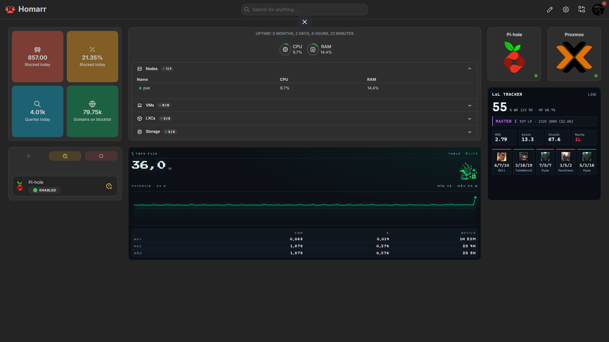

# LoL Tracker

Servei que es baixa les meves partides de League of Legends de la API de Riot, se les guarda en una SQLite i les ensenya en un widget dins de Homarr.

És el segon servei que programo jo, després del [Power Monitor](../P110/README.md), i segueix la mateixa estructura: un bucle que va recollint dades i una API que només serveix l'últim que té.

## Demo



## Com funciona

```text
API de Riot
   │
   │ cada 10-60 min segons l'hora
   ▼
Sync (tasca asyncio)
   │
   ▼
SQLite  /data/lol.db
   │
   ▼
 FastAPI
├── /health
├── /stats
├── /matches
├── /rank-history
├── /champions
└── /widget
     │
     ▼
   Homarr
```

Només hi ha un procés parlant amb Riot. El widget pregunta a la API local, així que tenir Homarr obert a tres pestanyes no fa ni una crida extra a Riot.

L'elo el porta el mateix bucle de sync i viatja dins de `/stats`, per no haver de fer una segona petició des del navegador.

## Què mostra

Tot el que surt al widget és de **ranked solo/duo**. Si hi comptés els ARAMs, el winrate gran i l'elo de sota parlarien de partides diferents.

- Winrate de les últimes 20 partides
- Elo, LP i rècord de la temporada
- Com s'ha mogut el LP
- KDA, assistències de mitjana i vision score
- Participació en kills
- Ratxa actual
- Les últimes 5 partides amb la icona del campió
- Els 3 campions més jugats i el seu winrate
- Estat LIVE, o avís si la API key ha caducat

Les icones dels campions surten de **Data Dragon**, el CDN públic de Riot, que no necessita API key.

L'històric de LP comença el dia que arrenques el contenidor: Riot no en guarda cap, o sigui que el que no anoti el sync es perd. Només s'escriu una fila quan el LP s'ha mogut, perquè no s'ompli de mostres iguals.

## Configuració

Tot va al `.env` de l'arrel del repo:

```bash
RIOT_API_KEY=RGAPI-...
RIOT_GAME_NAME=ElMeuNom
RIOT_TAG_LINE=EUW
```

Opcionals:

```bash
RIOT_PLATFORM=euw1          # per defecte euw1
LOL_QUEUE_ID=420            # 420 soloq, 440 flex, 450 ARAM, all per totes
LOL_POLL_DAY_SECONDS=1800   # 08-16 h
LOL_POLL_EVENING_SECONDS=600
LOL_POLL_NIGHT_SECONDS=3600 # 00-08 h
```

## Les dues trampes de la API de Riot

Aquestes dues m'han fet perdre una estona, així que queden apuntades:

**1. Les keys de desenvolupament caduquen cada 24 h.** Mentre no en tingui una de personal, cada dia deixa de sincronitzar fins que la renovo. El widget ho canta en vermell en comptes d'ensenyar dades velles com si res.

**2. El PUUID va xifrat amb la key que el va generar.** Si el guardes al `.env` i la key rota, Riot respon `400 Bad Request - Exception decrypting`. Sembla un error de dades però és de credencials. Per això guardo el **Riot ID** (`Nom` + `TAG`), que és estable, i el PUUID el resolc en calent amb la key vigent. Si falla, el torna a resoldre i reintenta un cop, així una rotació de key es cura sola.

I una tercera de propina: `league-v4` va per la ruta de **plataforma** (`euw1`), mentre que `match-v5` i `account-v1` van per la **regional** (`europe`). Confondre-les dona un 404.

## API

```text
GET /health         estat del sync, si la key va bé, partides totals
GET /stats          agregats de les últimes N partides + elo
GET /matches        últimes partides amb la icona del campió
GET /rank-history   mostres de LP guardades, de més vella a més nova
GET /champions      els campions més jugats amb partides i winrate
GET /widget         el widget que s'incrusta a Homarr
```

## Docker

Corre dins del LXC de Homarr, al port **8766**. El compose és a l'arrel del repo:

```bash
docker compose up -d --build lol-tracker
docker compose logs -f lol-tracker
```

A Homarr s'afegeix com a iframe apuntant a:

```text
http://192.168.68.252:8766/widget
```

Per tornar a baixar totes les partides des de zero, per exemple després d'afegir una columna nova a la taula:

```bash
docker compose exec lol-tracker /app/.venv/bin/python lol_tracker.py --resync
```

Comprova que la key funciona **abans** d'esborrar res, no fos cas.

## Futur

- Fonts pixelades com les del widget del Power Monitor
- Fallback quan Data Dragon no té la icona (els noms no sempre coincideixen)
- LP guanyat o perdut per partida, creuant l'històric amb l'hora de cada game
